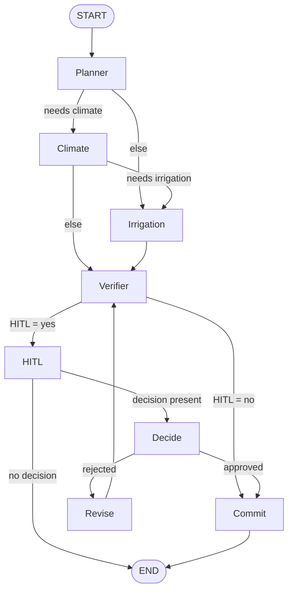

# Smart Greenhouse Using LangGraph

## Why LangGraph
- **Controllability & safety:** Explicit nodes/edges, durable state, and HITL interrupts suit CPS workflows where you must gate high-impact actions.
- **Reproducibility:** Checkpoints + deterministic control flow make runs auditable and easy to resume.
- **Extensible:** Swap the mock tools for real ones (weather API, TimescaleDB, SCADA proxy) without changing the graph structure.

## How it Works/What's Included
- State definition (`GHState`)
- Mock tools (`weather_forecast_tool`, `compute_kpis`)
- Nodes: Planner, Climate, Irrigation, Verifier, HITL, Decide, Revise, Commit
- Graph wiring (conditional edges + HITL pause)
- Two Demo Runs:
    - Demo A: pause → reject → pause → approve → commit
    - Demo B: auto-commit (no HITL)
- A helper that writes a Markdown file containing a Mermaid diagram for easy viewing in VS Code


## Setup & Run

### 1. Create and activate a virtual environment
```bash
python -m venv .venv
source .venv/bin/activate      # Windows: .venv\Scripts\activate
```
### 2. Install Dependencies
```bash
pip install langgraph langchain pydantic
```
### 3. Run the Demo
```bash
python greenhouse_langgraph_demo.py
```

## Output
### Demo A
```bash
=== DEMO A LOG (pause → reject → pause → approve → commit) ===
Planner: evaluating telemetry & deciding routes
Planner: needs=['irrigation', 'climate']
Climate: proposing hourly setpoints to hit VPD 0.9–1.1
Irrigation: scheduling safe micro-pulses to raise θv → 0.32
Verifier: computing KPIs and checking conflicts
Verifier: risk_index=20.0, HITL=yes
HITL: awaiting approval for proposed plan
Planner: evaluating telemetry & deciding routes
Planner: needs=['irrigation', 'climate']
Climate: proposing hourly setpoints to hit VPD 0.9–1.1
Irrigation: scheduling safe micro-pulses to raise θv → 0.32
Verifier: computing KPIs and checking conflicts
Verifier: risk_index=20.0, HITL=yes
HITL: awaiting approval for proposed plan
Revise: reviewer requested changes → shrinking adjustments
Verifier: computing KPIs and checking conflicts
Verifier: risk_index=20.0, HITL=yes
HITL: awaiting approval for proposed plan
Planner: evaluating telemetry & deciding routes
Planner: needs=['irrigation', 'climate']
Climate: proposing hourly setpoints to hit VPD 0.9–1.1
Irrigation: scheduling safe micro-pulses to raise θv → 0.32
Verifier: computing KPIs and checking conflicts
Verifier: risk_index=20.0, HITL=yes
HITL: awaiting approval for proposed plan
Commit: applying plan to SCADA proxy (demo: no-op)
```
### Demo B
```bash
=== DEMO B LOG (auto-commit) ===
Planner: evaluating telemetry & deciding routes
Planner: needs=['none']
Irrigation: scheduling safe micro-pulses to raise θv → 0.32
Verifier: computing KPIs and checking conflicts
Verifier: risk_index=0.0, HITL=no
Commit: applying plan to SCADA proxy (demo: no-op)
Wrote Mermaid diagram to graph.mmd
```

### Mermaid Diagram

